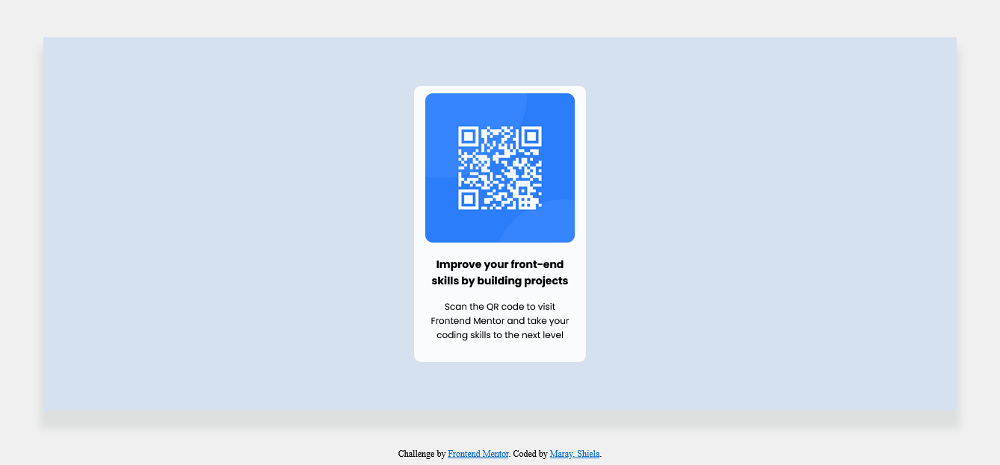

# Frontend Mentor - QR code component solution

This is a solution to the [QR code component challenge on Frontend Mentor](https://www.frontendmentor.io/challenges/qr-code-component-iux_sIO_H). Frontend Mentor challenges help you improve your coding skills by building realistic projects. 

## Table of contents

- [Overview](#overview)
  - [Screenshot](#screenshot)
  - [Links](#links)
- [My process](#my-process)
  - [Built with](#built-with)
  - [What I learned](#what-i-learned)
  - [Continued development](#continued-development)
  - [Useful resources](#useful-resources)
- [Author](#author)
- [Acknowledgments](#acknowledgments)


## Overview

### Screenshot




### Links

- Solution URL: [Add solution URL here](https://github.com/marayshiela/qr-code-frontend.git)
- Live Site URL: [Add live site URL here](https://marayshiela.github.io/qr-code-frontend/)

## My process

### Built with

- HTML and CSS


### What I learned

I discovered that even just html and CSS, you can develop a pretty attractive front-end design.

To see how you can add code snippets, see below:

```html
<h1>Some HTML code I'm proud of</h1>
```
```css
.proud-of-this-css {
  box-shadow: 0 20px 10px 5px #dddede;
}
```


### Continued development

I'd like to learn more CSS code that is brief but has a significant impact on front-end design.


### Useful resources

- Box-shadow(https://developer.mozilla.org/en-US/docs/Web/CSS/box-shadow) - This helped me in achieving the required shadow appearance


## Author

- Github - [@marayshiela](https://github.com/marayshiela)
- Frontend Mentor - [marayshiela](https://www.frontendmentor.io/profile/marayshiela)


## Acknowledgments

Thank you front-end mentor for allowing me to create this project.
